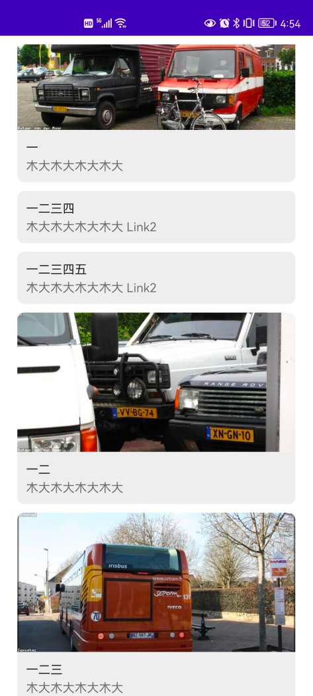

# rv

RecyclerView 扩展：itemtype, loadmore, selection, decoration

- rv-itemtype
  - 基于 ListAdapter 内置支持 AsyncListDiffer
  - 支持单类型列表(SingleTypeAdapter)和多类型列表(ItemTypeAdapter)
  - `ItemType<Item, Holder>` 表示列表里的一个类型
    - 通过 create 创建 Holder
    - 通过 matches 判断是否与数据(Item)关联
    - 通过 bind 将关联的数据(Item)呈现到 Holder
  - ItemSubtype 支持一个数据类型对应多个子类型布局
  - 内置的 ViewItemType 可以方便地将自定义视图(View)与数据(Item)关联组成一个ItemType
  - 内置的 LayoutItemType 可以方便地将布局(layoutResId)与数据(Item)关联组成一个ItemType
  - 内置的 bindingType 函数封装了 LayoutItemType 以支持 DataBinding
- rv-loadmore，支持加载更多的多类型列表(LoadMoreAdapter)
  - 在 rv-itemtype, [statelayout](https://github.com/czy1121/statelayout) 的基础上实现了加载更多
  - 支持显示多种状态: loading, offline, empty, hasMore, ended, error
    - 开始加载：有网(loading), 无网(offline)
    - 完成加载：无数据(empty)
    - 完成加载/加载下一页：有数据有下一页(hasMore), 有数据无下一页(ended)
    - 加载下一页：出错(error)
- rv-selection，基于 recyclerview-selection, ListAdapter 和 StringKey 的单选/多选库
  - selectionTracker 构造一个 SelectionTracker<String>
  - SelectionViewModel 保存了当前的选择状态
- rv-decoration
  - DividerDecoration 为列表项之间添加分隔线
  - SpaceDecoration 为列表项之间添加空白




## 引入

``` groovy
repositories {
    maven { url "https://gitee.com/ezy/repo/raw/cosmo/"}
}
dependencies {
    implementation "me.reezy.cosmo:rv-itemtype:0.7.0"
    implementation "me.reezy.cosmo:rv-loadmore:0.7.0"
    implementation "me.reezy.cosmo:rv-selection:0.7.0"
    implementation "me.reezy.cosmo:rv-decoration:0.7.0"
}
```

## SingleTypeAdapter 用法

```kotlin
class MainActivity : AppCompatActivity(R.layout.activity_main) {

    private val binding by lazy { ActivityMainBinding.bind(findViewById<ViewGroup>(android.R.id.content).getChildAt(0)) }

    private val list = listOf(
        Link(image = "https://loremflickr.com/600/300/d?lock=1", text = "一", desc = "木大木大木大木大"),
        Link(image = "https://loremflickr.com/600/300/d?lock=2", text = "一二", desc = "木大木大木大木大"),
        Link(image = "https://loremflickr.com/600/300/d?lock=3", text = "一二三", desc = "木大木大木大木大"),
        Link(image = "https://loremflickr.com/600/300/d?lock=4", text = "一二三四", desc = "木大木大木大木大"),
        Link(image = "https://loremflickr.com/600/300/d?lock=5", text = "一二三四五", desc = "木大木大木大木大"),
        Link(image = "https://loremflickr.com/600/300/d?lock=6", text = "一二三四五六", desc = "木大木大木大木大"),
        Link(image = "https://loremflickr.com/600/300/d?lock=7", text = "一二三四五六七", desc = "木大木大木大木大"),
    )

    private val adapter = SingleTypeAdapter(bindingType<Link>(R.layout.item_link))

    override fun onCreate(savedInstanceState: Bundle?) {
        super.onCreate(savedInstanceState)

        binding.list.adapter = adapter

        adapter.submitList(list)
    }
}
```

## ItemTypeAdapter 用法


```kotlin
class MainActivity : AppCompatActivity(R.layout.activity_main) {

    private val binding by lazy { ActivityMainBinding.bind(findViewById<ViewGroup>(android.R.id.content).getChildAt(0)) }

    private val list = listOf(
        Link(image = "https://loremflickr.com/600/300/d?lock=1", text = "一", desc = "木大木大木大木大"),
        Link2(image = "https://loremflickr.com/600/300/d?lock=4", text = "一二三四", desc = "木大木大木大木大 Link2"),
        Link2(image = "https://loremflickr.com/600/300/d?lock=5", text = "一二三四五", desc = "木大木大木大木大 Link2"),
        Link(image = "https://loremflickr.com/600/300/d?lock=2", text = "一二", desc = "木大木大木大木大"),
        Link(image = "https://loremflickr.com/600/300/d?lock=3", text = "一二三", desc = "木大木大木大木大"),
        Link2(image = "https://loremflickr.com/600/300/d?lock=6", text = "一二三四五六", desc = "木大木大木大木大 Link2"),
        Link2(image = "https://loremflickr.com/600/300/d?lock=7", text = "一二三四五六七", desc = "木大木大木大木大 Link2"),
    )

    private val adapter by lazy {
        ItemTypeAdapter<Any>().setup {
            add(bindingType<Link>(R.layout.item_link))
            add(bindingType<Link2>(R.layout.item_link2))
        }
    }

    override fun onCreate(savedInstanceState: Bundle?) {
        super.onCreate(savedInstanceState)

        binding.list.adapter = adapter

        adapter.submitList(list)
    }
}
```


## LICENSE

The Component is open-sourced software licensed under the [Apache license](LICENSE).